この拡張は、今のところChromeストアで公開していないため、手動でインストールする必要があります。  
まず以下より、拡張機能をストア以外の場所からインストールする方法を示し、そのあとにこの拡張機能の使い方を示します。

## 1. Chrome, またはEdgeの「拡張機能」ページを開く

以下のURLをアドレスバーに入力する。

Chrome の場合
```
chrome://extensions/
```

Edge の場合
```
edge://extensions/
```

## 2. 「開発者モード」を有効にする
以下の画像の赤丸で囲われた部分をクリックして、開発者モードを有効にする。  
赤ニョロは気にしない（これが出てたら有効だよぐらいの意味）

Chromeの場合
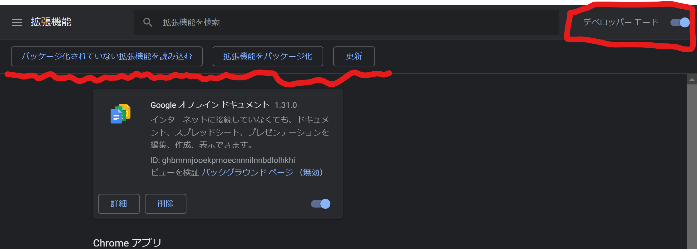

Edgeの場合
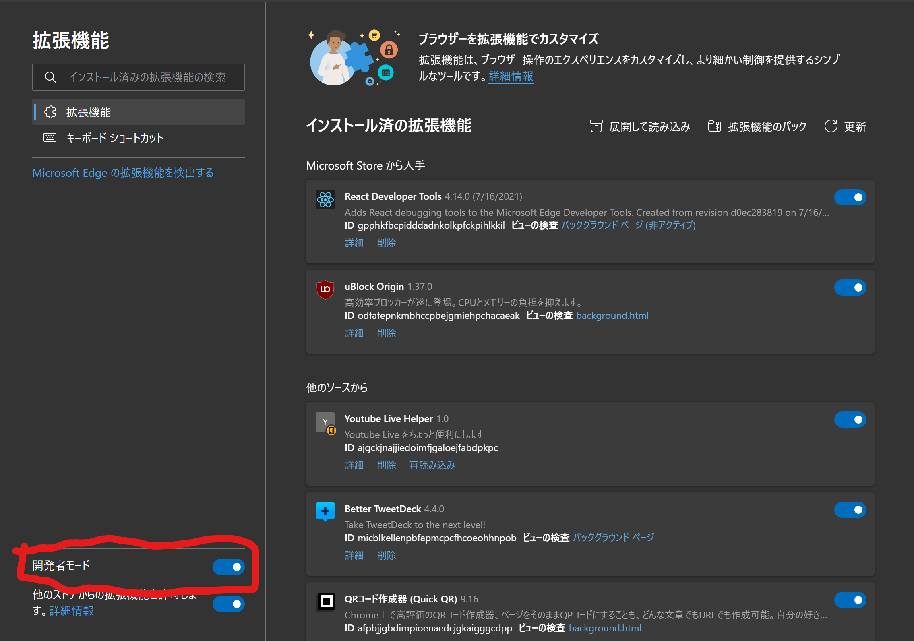

## 3. このページに、YTLH_betaのフォルダをドラッグアンドドロップ する。

YTLH_beta.zip は [ここ](https://github.com/hapo31/YouTubeLiveHelper/releases/download/0.0.1/YTLH_beta.zip)からダウンロードして解凍する。

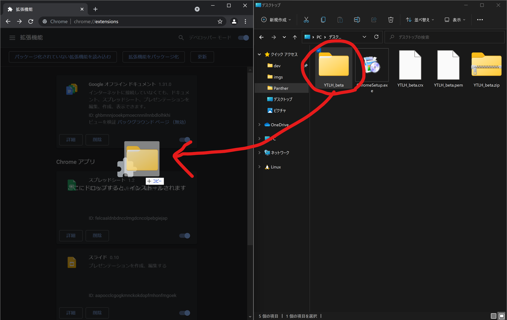

## 4. こういうのが出てきたら準備完了

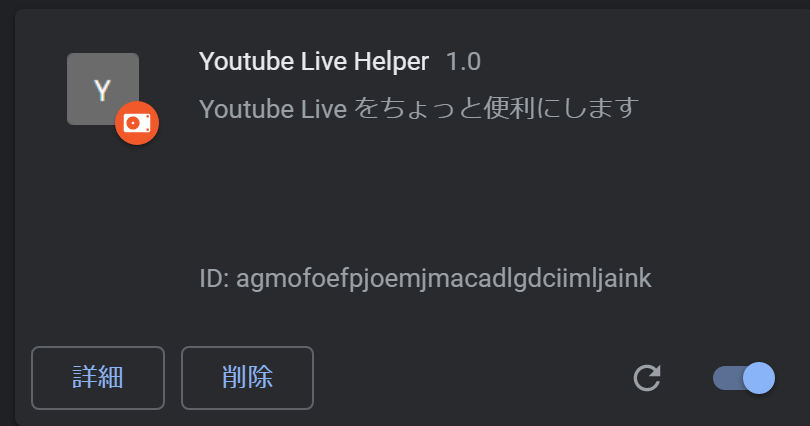

# YouTube Live Helper 拡張機能の使い方

## 0. 拡張機能バーに表示されていなければ固定する

Edge だといきなり表示されてるかも。  
以下はChromeの場合

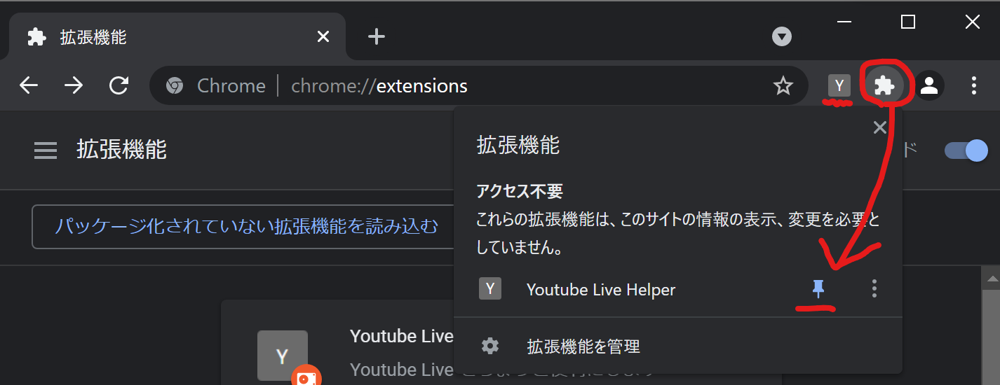
赤丸の部分をクリックして出てきたメニューのピン止めマークを押すと、拡張機能のところに「Y」アイコンが表示されるはず。

## 1. アイコンをクリックして、ポップアップを表示する

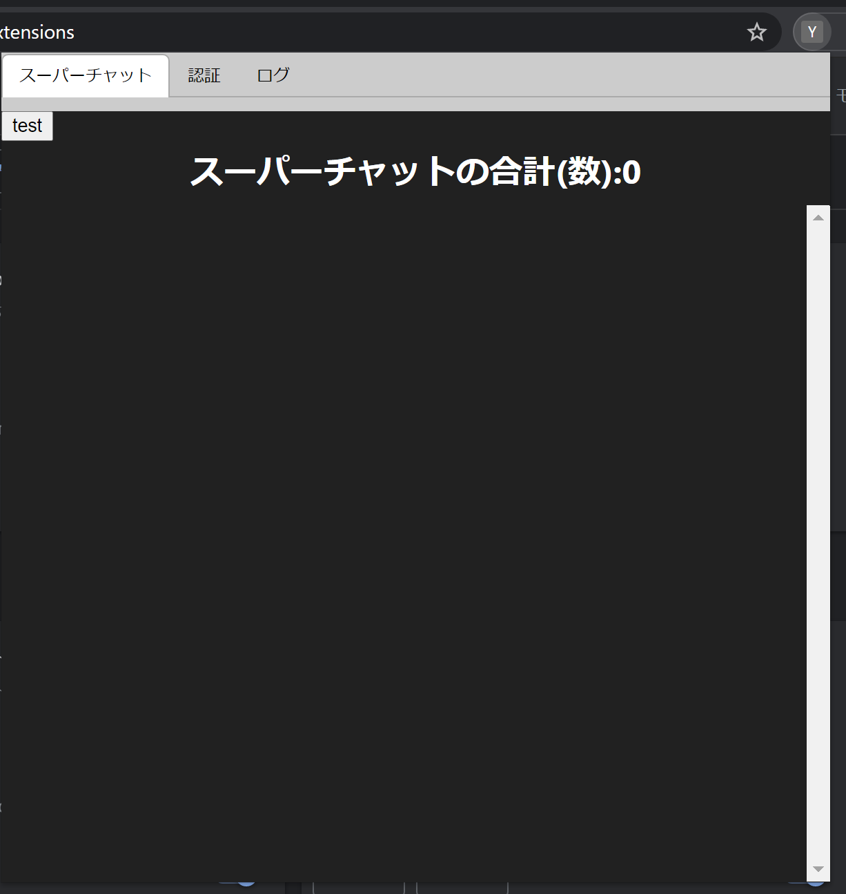

## 2. 「認証」タブをクリックして「認証する」ボタンを押して、しばらく待つ

### ごめんなさい、安いサーバーを使ってるので応答まで時間がかかります。
### しかも作りがまずくて、別のところをクリックしたりして閉じてしまうとこの処理は中断されてしまいます
### なので、しばらくこの画面で触らずにお待ちください・・・。

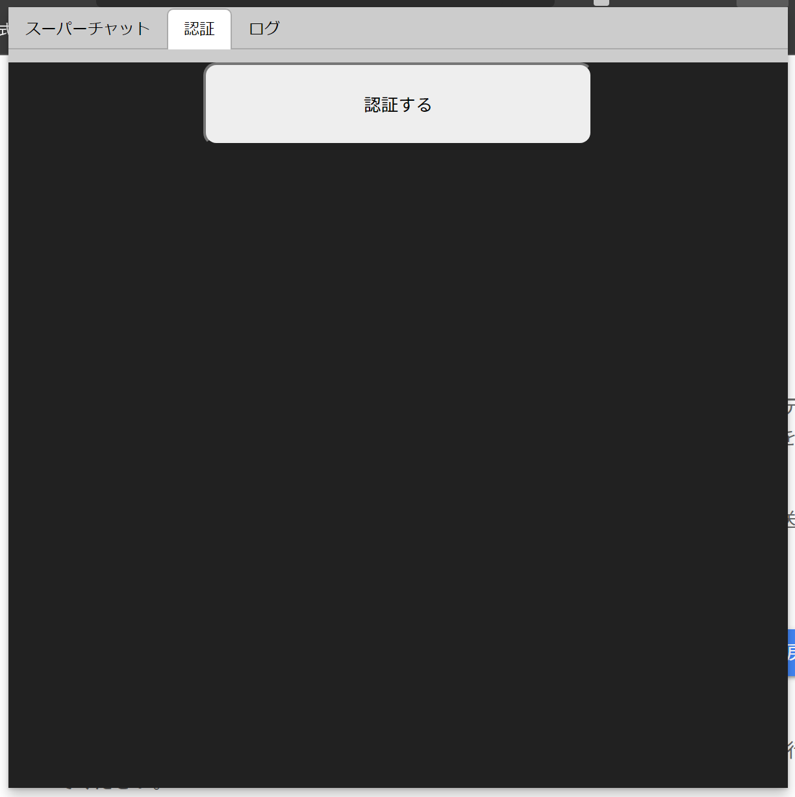


## 3. しばらくすると、Googleのログインページが開くので、ログインする。

この時点でポップアップは閉じて大丈夫。

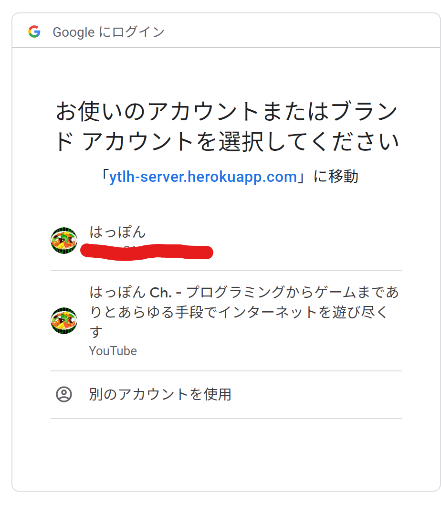

## 4. 以下の警告が出るので、手順に従って次に進む

### これは僕のせいなので、この画面が出なくなるようにそのうちきちんと認証します…。

「詳細」
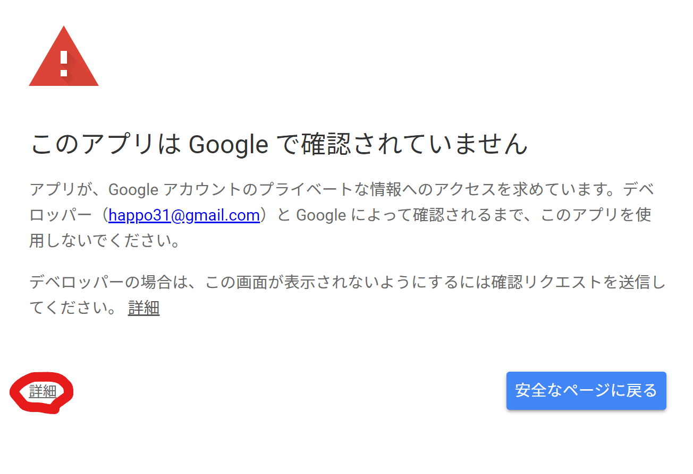

「ytlh-server.herokuapp.com（安全ではないページ）に移動」
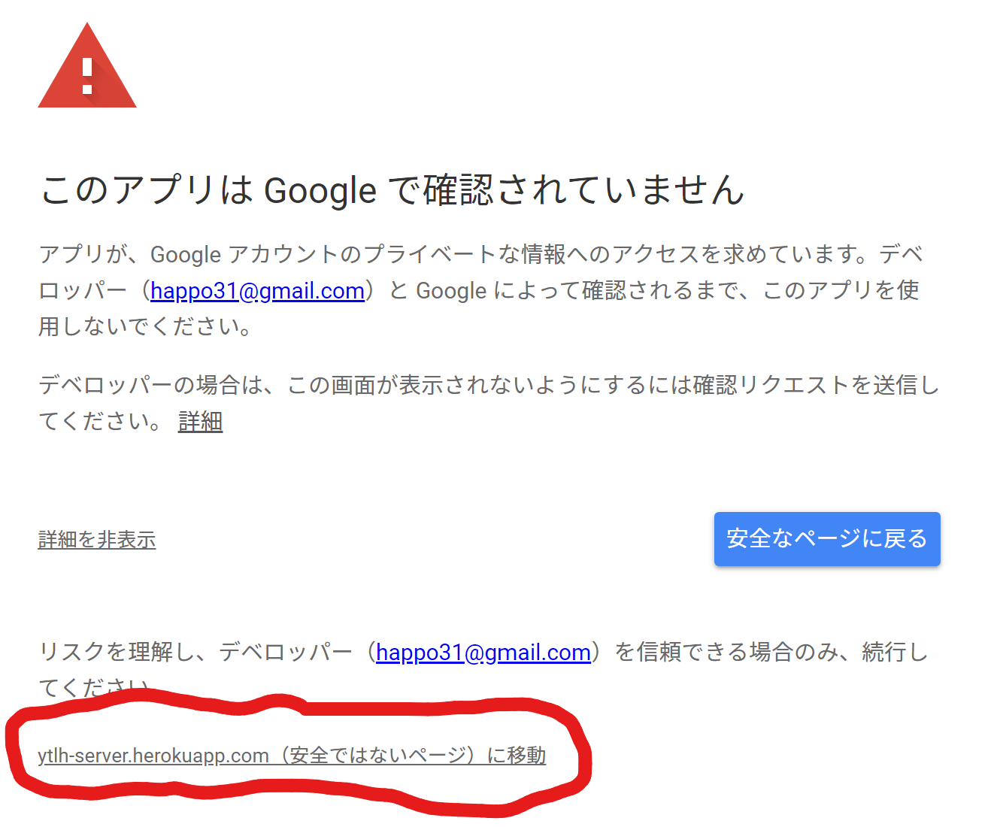

## 5. アクセス権限を確認して付与し、 Continue

### チェックボックスが出てたらチェックを入れてあげること。
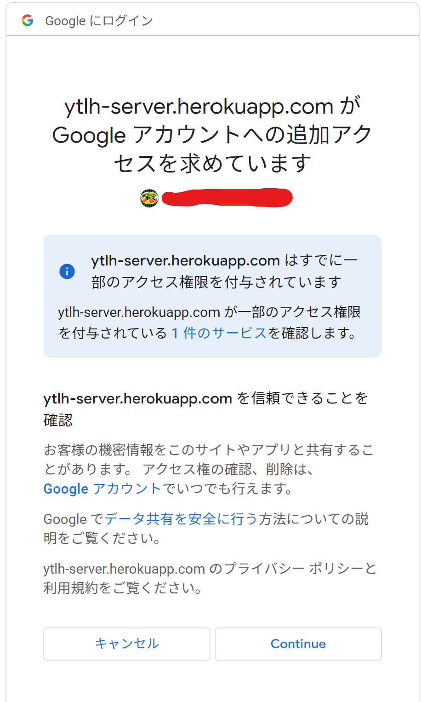


## 6. 以下の画面が出てきたら認証完了

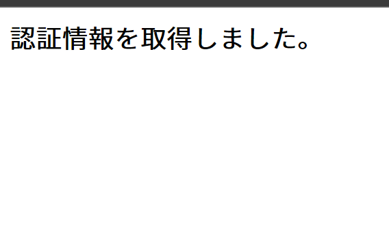

~~クソみてーに簡単な画面だな~~

## 7. もう一度「Y」アイコンをクリックしてポップアップを表示し、「ログ」タブを確認する

## 8. 画像の赤線に出てくる長い文字列をコピーして僕に報告！

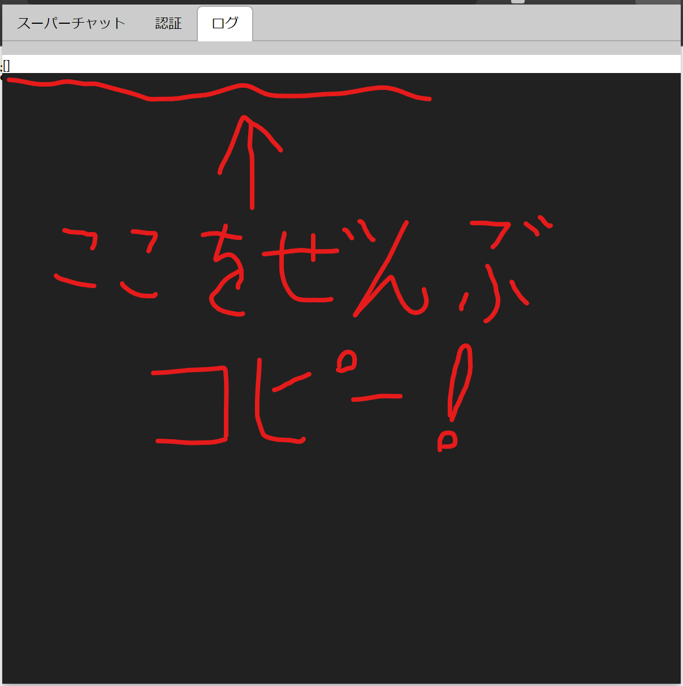

きちんと動いていればここにスパチャの情報が出てくるはず・・・。  
~~ちなみに僕は収益化通ってないので空っぽです~~
